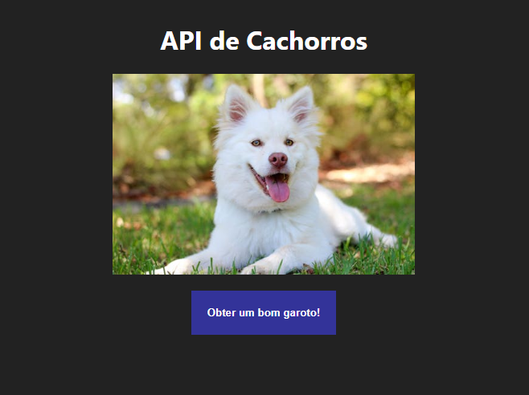

# API de Cachorros
*Atividade criada por Tiago Quadros*

## Objetivo
Nosso objetivo aqui é criar uma integração com uma API para imagens de cachorros.

## Habilidades Esperadas
- Assimilar os conceitos básicos de JS e TS
- Manipular timers
- Gerenciar eventos

## Como entregar a atividade?
As atividade devem ser enviadas em um arquivo zip, apenas com os seus códigos (as dependências podem ser reinstaladas apenas com o `package.json`).

[FORMULÁRIO PARA ENVIO](https://forms.gle/iJKx4yrXPouE5KpU8)

## Requisitos

### 1 - Criar a estrutura inicial.
Você irá precisar criar uma estrutura que contenha um arquivo `index.html` e um arquivo `script.js` que deve ser vinculado ao arquivo HTML.

### 2 - Crie os elementos básicos do HTML.
De forma básica, a página deve conter 1 botão que ao clicar deve fazer uma nova requisição e um elemento de imagem que irá receber a imagem carregada.

### 3 - Crie a requisição
Utilizando o evento `onClick`, faça com que a sua requisição seja executada.
A requisição deve ser feita para `https://dog.ceo/api/breeds/image/random`, você pode conferir a requisição na guia Network do seu navegador.

### 4 - A imagem deve atualizar a cada 5 segundos
Você irá fazer com que a primeira requisição aconteça quando o usuário clicar no botão. As requisições seguintes irão acontecer a cada 5 segundos, ou se o usuário clicar novamente.

### 5 - Resetar contador em caso de clique do usuário
Toda vez que o usuário clicar no botão, o contador de 5 segundos deve ser resetado.

